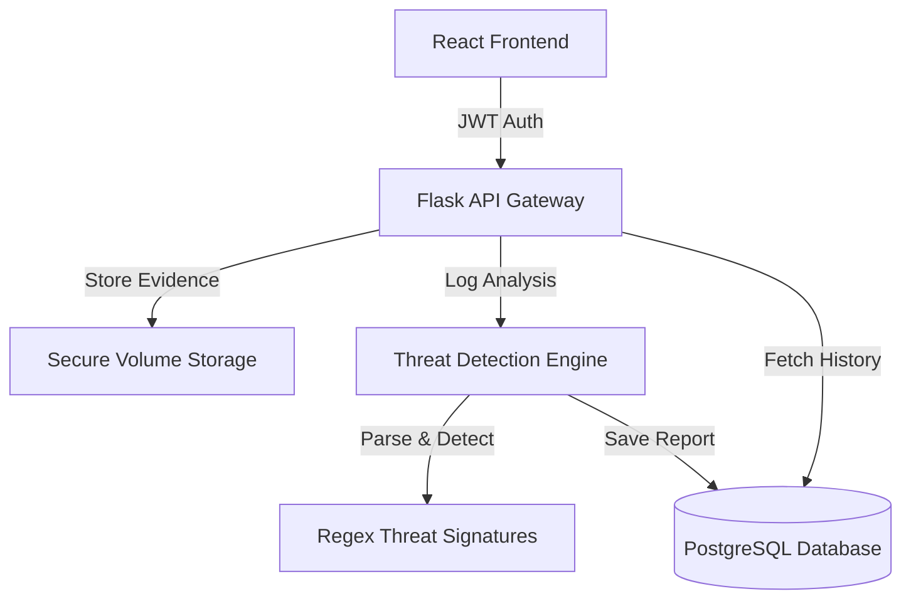

# SecureSME - DevSecOps Enabled Evidence Management Platform


**SecureSME** is a secure, full-stack platform designed to maintain the chain of custody for digital forensic evidence. It features an automated **Threat Intelligence Engine** that parses raw server logs to detect brute-force attacks and privilege escalation in real-time.

## Architecture


## Key Features

* **Automated Threat Intelligence:** Parses unstructured server logs (`syslog`, `auth.log`) to identify high-severity incidents like SSH brute force and Root access attempts.
* **Visual Analytics Dashboard:** Transforms raw audit data into interactive **Threat Severity Distribution charts**, allowing admins to assess risk at a glance.
* **Granular RBAC:** Enforces **Role-Based Access Control**, restricting sensitive analytics to Administrators while allowing standard users to maintain chain-of-custody uploads.
* **DevSecOps Pipeline:** Integrated **Bandit** (SAST) and **Safety** (Dependency Check) into GitHub Actions to block insecure code before deployment.
* **Containerized Infrastructure:** Fully Dockerized microservices architecture with `docker-compose` for consistent deployment.


## Tech Stack

* **Backend:** Python (Flask), SQLAlchemy, Regular Expressions (Regex)
* **Frontend:** React (Vite), TailwindCSS
* **Database:** PostgreSQL (with automated Alembic migrations)
* **DevOps:** Docker, GitHub Actions, Pre-commit hooks

##  Installation & Setup

1.  **Clone the repository**
    ```bash
    git clone https://github.com/Murashidzi/SecureSME-Platform.git
    cd SecureSME-Platform
    ```

2.  **Start with Docker**
    ```bash
    sudo docker-compose up -d --build
    ```

3.  **Access the Dashboard**
    * Frontend: `http://localhost:5173`
    * API: `http://localhost:5000`

##  Testing the Threat Engine

1.  Login via the dashboard.
2.  Upload a standard Linux log file (e.g., `auth.log`).
3.  The engine immediately scans for patterns defined in `app/utils/log_parser.py`.
4.  Results are visualized in the "Threat Intelligence Report" table.

---
*Built by Murashidzi as a demonstration of DevSecOps and Software Engineering principles.*
